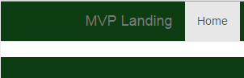

# Index
- [2	START PROJECT](README.md#2-start-project)
- [3	FIRST MIGRATION](README.md#3-first-migration)
- [4 ADMIN & SUPERUSER](README.md##4-admin--superuser)
- [5 APPS](README.md##5-apps)
- [6 FIRST VIEW AND URL ROUTING](README.md##6-first-view-and-url-routing)
- [7 DJANGO SETTING OVERVIEW](README.md#7-django-setting-overview)
- [8 TEMPLATE CONFIGURATION](README.md#8-template-configuration)
- [9 MODELS](README.md#9-models)
- [10 ADMIN](README.md#10----admin)
- [11 MODEL FORM](README.md#11----model-form)
- [12 FORM VALIDATION](README.md#12----form-validation)
- [13 VIEW AND TEMPLATE CONTEXT](README.md#13----view-and-template-context)
- [14 FORM IN A VIEW](README.md#14----form-in-a-view)
- [15 CUSTOM FORM IN A VIEW (NON MODELFORM)](README.md#15----custom-form-in-a-view-non-modelform)
- [16 SETUP EMAIL](README.md#16----setup-email)
- [17 STATIC FILE IN DJANGO1.8](README.md#17----static-file-in-django18)
- [18 SERVING STATIC FILES](README.md#18----serving-static-files)
- [19 ADDING BOOTSTRAP TO DJANGO](README.md#19----adding-bootstrap-to-django)
- [20 DJANGO TEMPLATE INCLUDE, INHERITANCE, BLOCKS](README.md#20----django-template-include-inheritance-blocks)
- [21 THIRD PARTY LIBRARY CRISPY FORM](README.md#21----third-party-library-crispy-form)
- [22 BOOTSTRAP GRID SYSTEM](README.md#22----bootstrap-grid-system)
- [23 STYLING MVP LANDING PART1](README.md#23----styling-mvp-landing-part1)
- [24 CSS WITH BLOCKS](README.md#24----css-with-blocks)
- [25 URL NAMES AS LINKS](README.md#25----url-names-as-links)
- [26 STYLING MVP LANDING PART2](README.md#26----styling-mvp-landing-part2)
- [27 DJANGO REGISTRATION REDUX](README.md#27----django-registration-redux)
- [28 UPDATE DJANGO LOGIN URL TO CUSTOM URL](README.md#28----update-django-login-url-to-custom-url)
- [29 AUTHENTICATION LINKS IN NAVBAR](README.md#29----authentication-links-in-navbar)
- [30 LOGIN FORM IN BOOTSTRAP NAVBAR](README.md#30----login-form-in-bootstrap-navbar)
- [31 STYLING MVP LANDING PART3](README.md#31----styling-mvp-landing-part3)
- [32 LOGO IMAGE IN NAVBAR](README.md#32----logo-image-in-navbar)
- [33 PROMO VIDEO AND IMAGE](README.md#33----promo-video-and-image)
- [34 ICON WITH FONT AWESOME](README.md#33----promo-video-and-image)
- [35 CONTENT FOR AUTHENTICATED USERS](README.md#35----content-for-authenticated-users)
- [36 QUERYSETBASICS](README.md#36----querysetbasics)
- [37 SETTING FOR DIFFERENT ENVIRONMENT](README.md#37----setting-for-different-environment)

# 2	START PROJECT
## 创建开发环境 virtualenv 
创建工作目录：D:\virtualdir\trydjango18
``` dos
D:\>mkdir virtualdir & cd virtualdir
```
创建虚拟环境工作区
``` dos
D:\>virtualenv trydjango18
```
> 
<pre>
New python executable in trydjango18\Scripts\python.exe  
Installing setuptools, pip, wheel...done.  
</pre>

查看生成的文件: `D:\virtualdir\trydjango18>ls`
> 
<pre>
Include  Lib  Scripts
</pre>

视频教程里面苹果系统生成的目录是 bin include lib

## 激活虚拟环境
视频激活命令 source bin/activate

Windows激活
``` dos
D:\virtualdir\trydjango18>Scripts\activate
(trydjango18) D:\virtualdir\trydjango18>
```

查看生成的库
``` dos
(trydjango18) D:\virtualdir\trydjango18>pip freeze
```
> <pre>wheel==0.24.0</pre>

视频教程里面生成的目录是 wsgiref==0.1.2

## 安装Django
可以从django网站获取最新的django版本信息  
https://www.djangoproject.com/download/  
通过pip安装django  
`pip install django` 会安装最新的版本  

指定版本安装
``` dos
(trydjango18) D:\virtualdir\trydjango18>pip install django==1.8
```

安装完成之后可以通过pip freeze查看当前的版本信息
``` dos
(trydjango18) D:\virtualdir\trydjango18>pip freeze
```
> 
<pre>
Django==1.8  
wheel==0.24.0  
</pre>

`pip freeze > requirements.txt` 将安装软件信息存储到requirements.txt  
后面可以通过`pip install –r requirements.txt`直接安装全部软件

## Start Project
``` dos
(trydjango18) D:\virtualdir\trydjango18>django-admin.py startproject trydjango18
生成的文件如下:
```
> <pre> Include  Lib  Scripts  pip-selfcheck.json  trydjango18 </pre>

执行startproject命令后，会生成下列文件
> 
<pre>
 trydjango18/
    __init__.py
    manage.py
    settings.py
    urls.py
</pre>


为避免与virtualenv名字冲突，把项目目录改成 “src”

``` dos
(trydjango18) D:\virtualdir\trydjango18>rename trydjango18 src & dir
```
> 
<pre> 
 Volume in drive D is HP_RECOVERY
 Volume Serial Number is E237-2AC8
Directory of D:\virtualdir\trydjango18
2016/02/09  19:45    <DIR>          .
2016/02/09  19:45    <DIR>          ..
2015/12/11  23:42    <DIR>          Include
2016/02/09  19:28    <DIR>          Lib
2016/02/09  19:33                60 pip-selfcheck.json
2016/02/09  19:37    <DIR>          Scripts
2016/02/09  19:42    <DIR>          src
               1 File(s)             60 bytes
               6 Dir(s)  38,498,160,640 bytes free
</pre>
               

## Emulate a django server
``` dos
(trydjango18) D:\virtualdir\trydjango18\src>python manage.py runserver
```
> 
<pre>
Performing system checks...
System check identified no issues (0 silenced).
February 09, 2016 - 19:48:35
Django version 1.8, using settings 'trydjango18.settings'
Starting development server at http://127.0.0.1:8000/
Quit the server with CTRL-BREAK.
</pre>

默认端口是8000, 也可以通过下列命令制定端口
``` dos
python manage.py runserver 8080
python manage.py runserver 0.0.0.0:8000
```


## 将代码提交到github
先创建repository trydjango18course
``` dos
echo "# trydjango18course" >> README.md
git init
git add README.md
git commit -m "first commit"
git remote add origin git@github.com:navicester/trydjango18course.git
git push -u origin master
```

# 3	FIRST MIGRATION
``` dos
(trydjango18) D:\virtualdir\trydjango18\src>python manage.py migrate
```
如果直接运行migrate命令，会有报错: *settings.DATABASES is improperly configured*,这是因为我们的database没有配置好

## 修改settings.py
添加 “ENGINE” 和 “NAME” 配置，例子中我们选用sqlite3，关于mysql的配置会有专门章节介绍
``` python
DATABASES = {
    'default': {
        'ENGINE': 'django.db.backends.sqlite3', # Add 'postgresql_psycopg2', 'mysql', 'sqlite3' or 'oracle'.
        'NAME': 'db.sqlite3',                   # Or path to database file if using sqlite3.

        # The following settings are not used with sqlite3:
        'USER': '',
        'PASSWORD': '',
        'HOST': '',                             # Empty for localhost through domain sockets or '127.0.0.1' for localhost through TCP.
        'PORT': '',                             # Set to empty string for default.
    }
}
```

Database配置好了之后，再次运行migrate

``` dos
(trydjango18) D:\virtualdir\trydjango18\src>python manage.py migrate
```
> 
<pre>
Operations to perform:
  Synchronize unmigrated apps: staticfiles, messages
  Apply all migrations: contenttypes, sites, auth, sessions
Synchronizing apps without migrations:
  Creating tables...
    Running deferred SQL...
  Installing custom SQL...
Running migrations:
  Rendering model states... DONE
  Applying contenttypes.0001_initial... OK
  Applying contenttypes.0002_remove_content_type_name... OK
  Applying auth.0001_initial... OK
  Applying auth.0002_alter_permission_name_max_length... OK
  Applying auth.0003_alter_user_email_max_length... OK
  Applying auth.0004_alter_user_username_opts... OK
  Applying auth.0005_alter_user_last_login_null... OK
  Applying auth.0006_require_contenttypes_0002... OK
  Applying sessions.0001_initial... OK
  Applying sites.0001_initial... OK
  </pre>
  
  python manage.py syncdb从1.9开始会被删除掉

# 4	ADMIN & SUPERUSER
**Createsuperuser**命令可以用来创建超级用户，该命令任意时间都能执行
``` dos
(trydjango18) D:\virtualdir\trydjango18\src>python manage.py createsuperuser
```
> 
<pre>
Username (leave blank to use 'alu'): alu
Email address: navicester@qq.com
Password:
Password (again):
Superuser created successfully.
</pre>

``` dos
(trydjango18) D:\virtualdir\trydjango18\src>python manage.py syncdb
```
> 
<pre>
D:\virtualdir\trydjango18\lib\site-packages\django\core\management\commands\syncdb.py:24: RemovedInDjango19Warning: The syncdb command will be removed in Django 1.9
  warnings.warn("The syncdb command will be removed in Django 1.9", RemovedInDjango19Warning)
Operations to perform:
  Synchronize unmigrated apps: staticfiles, admindocs, messages
  Apply all migrations: admin, contenttypes, sites, auth, sessions
Synchronizing apps without migrations:
  Creating tables...
    Running deferred SQL...
  Installing custom SQL...
Running migrations:
  Rendering model states... DONE
  Applying admin.0001_initial... OK
  </pre>
  
## enable admin
去掉setting和url中的一些注释语句
  
*setting.py*
  
``` python
INSTALLED_APPS = (
    # Uncomment the next line to enable the admin:
    'django.contrib.admin',
    # Uncomment the next line to enable admin documentation:
    'django.contrib.admindocs',
)
```
*urls.py*
``` python
# Uncomment the next two lines to enable the admin:
from django.contrib import admin
admin.autodiscover()

urlpatterns = patterns('',
    # Uncomment the admin/doc line below to enable admin documentation:
    url(r'^admin/doc/', include('django.contrib.admindocs.urls')),
    # Uncomment the next line to enable the admin:
    url(r'^admin/', include(admin.site.urls)),
)
```

# 5 APPS
## startapp
创建app : newsletter
``` dos
(trydjango18) D:\virtualdir\trydjango18\src>python manage.py startapp newsletter
```
我们不能创建两个名字完全一样的application，但是可以创建于类似“admin” 这种build-in site-packages的application

它会创建下面文件
> 
<pre>
newsletter/
     __init__.py
     models.py
     tests.py
     views.py
     </pre>

# 6 FIRST VIEW AND URL ROUTING
添加最基本的view功能

## 首先添加url
*trydjango18\urls.py*
``` python
urlpatterns = patterns('',
    # Examples:
    url(r'^$', 'newsletter.views.home', name='home'),
)
```

| Symbol / Expression     | Matched String     |
|:--------|---------:|
|. | (Dot)	Any character. |
|^ | (Caret)	Start of string. |
|$ |	End of string. |
|* |	0 or more repetitions. |
|+ |	1 or more repetitions. |
|? |	0 or 1 repetitions. |
|\| |	A \| B means A or B. |
|[a-z]	| Any lowercase character. |
|\w	    | Any alphanumeric character or _. |
|\d	    |Any digit.  |

这儿的name后面可以用在template里面的url引用，例如

*templates\navbar.html*

``` html
<li class="active"><a href="">Home</a></li>
```

## 添加view里面的实现
文件*newsletter\view.py*
``` python
from django.shortcuts import render 

# Create your views here.
def home(request):
	context = {}
	return render(request, "home.html", context)

```

# 7	DJANGO SETTING OVERVIEW
*settings.py*的目录:
``` dos
(trydjango18) D:\virtualdir\trydjango18\src>tree /F
```
> 
<pre>
D:.
│  db.sqlite3
│  manage.py
│
├─newsletter
│  │  admin.py
│  │  models.py
│  │  tests.py
│  │  views.py
│  │  __init__.py
│  │
│  └─migrations
│          __init__.py
│
└─trydjango18
        settings.py
        settings.pyc
        urls.py
        urls.pyc
        wsgi.py
        wsgi.pyc
        __init__.py
        __init__.pyc

</pre>


``` python
"""
Django settings for trydjango18 project.
Generated by 'django-admin startproject' using Django 1.8.
For more information on this file, see
https://docs.djangoproject.com/en/1.8/topics/settings/
For the full list of settings and their values, see
https://docs.djangoproject.com/en/1.8/ref/settings/
"""
```

## 定义 BASE_DIR

返回当前路径的方法

``` python
import os.path
os.path.dirname(__file__)
```

``` python
# Build paths inside the project like this: os.path.join(BASE_DIR, ...)

import os
BASE_DIR = os.path.dirname(os.path.dirname(os.path.abspath(__file__)))
```

## ROOT_URLCONF
``` python
#root of project
ROOT_URLCONF = 'trydjango18.urls'
```

## MIDDLEWARE_CLASSES
介于request和response之间

## TEMPLATES
A list containing the settings for all template engines to be used with Django. Each item of the list is a dictionary containing the options for an individual engine.

Here’s a simple setup that tells the Django template engine to load templates from the templates subdirectory inside each installed application:

``` python
TEMPLATES = [
    {
        'BACKEND': 'django.template.backends.django.DjangoTemplates',
        'DIRS': [],
        'APP_DIRS': True,
        'OPTIONS': {
            'context_processors': [
                'django.template.context_processors.debug',
                'django.template.context_processors.request',
                'django.contrib.auth.context_processors.auth',
                'django.contrib.messages.context_processors.messages',
            ],
        },
    },
]
```

**Deprecated since version 1.8**

### TEMPLATE_DIRS

Default: () (Empty tuple)
**Deprecated since version 1.8**: Set the [DIRS](https://docs.djangoproject.com/en/1.8/ref/settings/#std:setting-TEMPLATES-DIRS) option of a DjangoTemplates backend instead.

List of locations of the template source files searched by [django.template.loaders.filesystem.Loader](https://docs.djangoproject.com/en/1.8/ref/templates/api/#django.template.loaders.filesystem.Loader), in search order.
Note that these paths should use Unix-style forward slashes, even on Windows.

### TEMPLATE_CONTEXT_PROCESSORS

Default:
``` python
(
    "django.contrib.auth.context_processors.auth",
    "django.template.context_processors.debug",
    "django.template.context_processors.i18n",
    "django.template.context_processors.media",
    "django.template.context_processors.static",
    "django.template.context_processors.tz",
"django.contrib.messages.context_processors.messages"
)
```

**Deprecated since version 1.8**: Set the 'context_processors' option in the [OPTIONS](https://docs.djangoproject.com/en/1.8/ref/settings/#std:setting-TEMPLATES-OPTIONS) of a DjangoTemplates backend instead.

A tuple of callables that are used to populate the context in RequestContext. These callables take a request object as their argument and return a dictionary of items to be merged into the context.

Changed in Django 1.8: 

Built-in template context processors were moved from django.core.context_processors to django.template.context_processors in Django 1.8.

### TEMPLATE_LOADERS
Default:
``` python
(
    'django.template.loaders.filesystem.Loader',
     'django.template.loaders.app_directories.Loader'
)
```

**Deprecated since version 1.8**: Set the 'loaders' option in the [OPTIONS](https://docs.djangoproject.com/en/1.8/ref/settings/#std:setting-TEMPLATES-OPTIONS) of a DjangoTemplates backend instead.

A tuple of template loader classes, specified as strings. Each Loader class knows how to import templates from a particular source. Optionally, a tuple can be used instead of a string. The first item in the tuple should be the Loader’s module, subsequent items are passed to the Loader during initialization. See [The Django template language: for Python programmers](https://docs.djangoproject.com/en/1.8/ref/templates/api/).

# 8	TEMPLATE CONFIGURATION
创建view处理函数
``` python
# Create your views here.
def home(request):
	context = {}
	return render(request, "home.html", context)
```

需要在项目中创建template文件并且指定搜索路径, 否则http://127.0.0.1:8000/ 将会报告下面的错误调试信息，该网站调用home()函数

下面的Debug信息显示，django只是搜了默认的系统路径，跟工程相关的路径并没有搜索

<pre>
TemplateDoesNotExist 
Template-loader postmortem
Django tried loading these templates, in this order:
    •	Using loader django.template.loaders.filesystem.Loader: 
    •	Using loader django.template.loaders.app_directories.Loader: 
        o	D:\virtualdir\trydjango18\lib\site-packages\django\contrib\auth\templates\home.html (File does not exist)
        o	D:\virtualdir\trydjango18\lib\site-packages\django\contrib\admin\templates\home.html (File does not exist)
        o	D:\virtualdir\trydjango18\lib\site-packages\django\contrib\admindocs\templates\home.html (File does not exist)
</pre>

## 指定INSTALLED_APP，默认搜索该目录下template目录
在newsletter下面创建template目录，并且在“INSTALLED_APPS”下面添加“newsletter”，django将会搜索该template目录
``` django
INSTALLED_APPS = (
    'django.contrib.admin',
    'django.contrib.auth',
    'django.contrib.contenttypes',
    'django.contrib.sessions',
    'django.contrib.messages',
    'django.contrib.staticfiles',
+	'newsletter'
)
```

如果将newsletter注释掉，django会不找不到模板文件

在newsletter下面，还需要创建*template/home.html*,否则报错如下:
> 
<pre>
Template-loader postmortem
Django tried loading these templates, in this order:
    •	Using loader django.template.loaders.filesystem.Loader: 
    •	Using loader django.template.loaders.app_directories.Loader: 
        o	D:\virtualdir\trydjango18\lib\site-packages\django\contrib\auth\templates\home.html (File does not exist)
        o	D:\virtualdir\trydjango18\lib\site-packages\django\contrib\admin\templates\home.html (File does not exist)
        o	D:\virtualdir\trydjango18\lib\site-packages\django\contrib\admindocs\templates\home.html (File does not exist)
        o	D:\virtualdir\trydjango18\src\newsletter\templates\home.html (File does not exist)  //指定目录下面没收到模板文件
</pre>

在“newsletter”下面创建文件“templats/home.html”, it works

## 指定template位置
本例子中，我们把templates从application目录中移到root文件夹，在src目录创建templates文件夹

修改settings.py中的template设置，添加目录到DIRS

``` python
TEMPLATES = [
    {
        'BACKEND': 'django.template.backends.django.DjangoTemplates',
        'DIRS': [os.path.join(BASE_DIR, "templates")],
        'APP_DIRS': True, # Whether the engine should look for template source files inside installed applications.
        'OPTIONS': {
            'context_processors': [
                'django.template.context_processors.debug',
                'django.template.context_processors.request',
                'django.contrib.auth.context_processors.auth',
                'django.contrib.messages.context_processors.messages',
            ],
        },
    },
]
```

如果home.html没有创建，django会抛出下面异常，否则, it works.
> 
<pre>
Template-loader postmortem
Django tried loading these templates, in this order:
    •	Using loader django.template.loaders.filesystem.Loader: 
        o	D:\virtualdir\trydjango18\src\templates\home.html (File does not exist)   //指定目录下面没收到模板文件
    •	Using loader django.template.loaders.app_directories.Loader: 
        o	D:\virtualdir\trydjango18\lib\site-packages\django\contrib\auth\templates\home.html (File does not exist)
        o	D:\virtualdir\trydjango18\lib\site-packages\django\contrib\admin\templates\home.html (File does not exist)
        o	D:\virtualdir\trydjango18\lib\site-packages\django\contrib\admindocs\templates\home.html (File does not exist)
</pre>


# 9	MODELS
https://docs.djangoproject.com/en/1.8/ref/models/

https://docs.djangoproject.com/en/1.8/ref/models/fields/

## 创建一个model SignUp
``` python
from django.db import models

# Create your models here.
class SignUp(models.Model):
	email = models.EmailField()
	full_name = models.CharField(max_length=120, blank=True, null=True)
	timestamp = models.DateTimeField(auto_now_add=True, auto_now=False)
	updated = models.DateTimeField(auto_now_add=False, auto_now=True)

	def __unicode__(self): #Python 3.3 is __str__
		return self.email
```
## 迁移数据库 migrate database

makemigrations : 初始化migrations

migrates : 实际运行migrations并且存储到database

``` dos
(trydjango18) D:\virtualdir\trydjango18\src>python manage.py makemigrations
```
> 
<pre>
Migrations for 'newsletter':
  0001_initial.py:
    - Create model SignUp
</pre>

``` dos
(trydjango18) D:\virtualdir\trydjango18\src>python manage.py migrate
```
> 
<pre>
Operations to perform:
  Synchronize unmigrated apps: staticfiles, admindocs, messages
  Apply all migrations: sessions, admin, sites, auth, contenttypes, newsletter
Synchronizing apps without migrations:
  Creating tables...
    Running deferred SQL...
  Installing custom SQL...
Running migrations:
  Rendering model states... DONE
  Applying newsletter.0001_initial... OK
</pre>

如果不做修改重新执行该命令，将显示`No migrations to apply`
``` dos
(trydjango18) D:\virtualdir\trydjango18\src>python manage.py migrate
```
> 
<pre>
Operations to perform:
  Synchronize unmigrated apps: staticfiles, admindocs, messages
  Apply all migrations: sessions, admin, sites, auth, contenttypes, newsletter
Synchronizing apps without migrations:
  Creating tables...
    Running deferred SQL...
  Installing custom SQL...
Running migrations:
  No migrations to apply.
</pre>


# 10	ADMIN
将自己的模块加入管理工具中，这样我们就能够通过这个漂亮的界面添加、修改和删除数据库中的对象了。

## 在Admin中注册SignUp
``` python
from django.contrib import admin
from .models import SignUp

admin.site.register(SignUp, SignUpAdmin)
```

model将会显示在admin中


## 定制管理模块 Customize admin
``` python
from django.contrib import admin

# Register your models here.
from .models import SignUp

class SignUpAdmin(admin.ModelAdmin):
	list_display = ["__unicode__", "timestamp", "updated"]
	class Meta:
		model = SignUp

admin.site.register(SignUp, SignUpAdmin)
```


# 11	MODEL FORM
Newsletter下面添加文件*forms.py*
``` python
from django import forms

from .models import SignUp
class SignUpForm(forms.ModelForm):
	class Meta:
		model = SignUp
		fields = ['full_name', 'email']
		### exclude = ['full_name']
```

修改 *admin.py*
``` python
from django.contrib import admin

# Register your models here.
+from .forms import SignUpForm
from .models import SignUp

class SignUpAdmin(admin.ModelAdmin):
	list_display = ["__unicode__", "timestamp", "updated"]
+	form = SignUpForm
+	# class Meta:
+	# 	model = SignUp

admin.site.register(SignUp, SignUpAdmin)
```

# 12	FORM VALIDATION
给 “email” & “full_name”添加validation函数 - clear_[field_name]
``` python
class SignUpForm(forms.ModelForm):
	class Meta:
		model = SignUp
		fields = ['full_name', 'email']
		### exclude = ['full_name']
	
	def clean_email(self):
		email = self.cleaned_data.get('email')
		email_base, provider = email.split("@")
		domain, extension = provider.split('.')
		# if not domain == 'USC':
		# 	raise forms.ValidationError("Please make sure you use your USC email.")
		if not extension == "edu":
			raise forms.ValidationError("Please use a valid .EDU email address")
		return email

	def clean_full_name(self):
		full_name = self.cleaned_data.get('full_name')
		#write validation code.
		return full_name
```

# 13	VIEW AND TEMPLATE CONTEXT

## 渲染模板
``` python
from django.shortcuts import render

# Create your views here.
def home(request):
	title = 'Welcome'

	if request.user.is_authenticated():
		title = "My title is %s" % (request.user)
		
	context = {
		"title": title,
	}

	return render(request, "home.html", context)
```

## 初始模板文件

*home.html*
``` vbscript-html
<h1>{{title}}</h1>
{{user}}
{{request.user}}
```
这两个user分别是由下面的middleware传进来的
``` python
    'django.template.context_processors.request',
    'django.contrib.auth.context_processors.auth',
```

# 14	FORM IN A VIEW
https://docs.djangoproject.com/en/1.8/ref/forms/

## 表单后台处理
``` python
+from .forms import SignUpForm
+from .models import SignUp

# Create your views here.
def home(request):
	title = 'Welcome'
+	form = SignUpForm(request.POST or None)
	context = {
		"title": title,
+		"form": form
	}
+	if form.is_valid():
+		#form.save()
+		#print request.POST['email'] #not recommended, raw data without validation
+		instance = form.save(commit=False)

+		full_name = form.cleaned_data.get("full_name")
+		if not full_name:
+			full_name = "New full name"
+		instance.full_name = full_name
+		# if not instance.full_name:
+		# 	instance.full_name = "Justin"
+		instance.save()
		
		context = {
			"title": "Thank you"
		}

	return render(request, "home.html", context)
```

`form = SignUpForm(request.POST or None)`这句话中记得加 or None，否则的话SignUpForm会一直执行Validation

即使只是网址GET访问，也会出现下列validation错误


	
调用form.is_valid，form会执行form类里面的那些validation函数

`form.save(commit=False)`并不会真正的保存数据 ，instance.save()才会真正保存
> 
This save() method accepts an optional commit keyword argument, which accepts either True or False. If you call save() with commit=False, then it will return an object that hasn’t yet been saved to the database. In this case, it’s up to you to call save() on the resulting model instance.

## 添加表单内容

*home.html*

``` html
<h1>{{title}}</h1>
{{user}}
{{request.user}}
+<form method="POST" action=''> 
+	{{form.as_p}}
+	<input type="submit" value="sign up">
+</form>
```
action指定了提交之后的重定向地址，可以用”.”

as_p = as paragraph

## GET vs POST
 

Home函数里添加下列打印
``` python
	print request
	print request.POST
```
在shell里面查看打印输出

如果只是执行网址访问http://127.0.0.1:8000/
> 
<pre>
<WSGIRequest: GET '/'>
<QueryDict: {}>
</pre>

如果按”sign up”提交
> 
<pre>
<WSGIRequest: POST '/'>
<QueryDict: {u'csrfmiddlewaretoken': [u'xcdCoiISxk5yS4GSbVHENmjWwnhvj7kk'], u'email': [u'bin@gmail.edu'], u'full_name': [u'bin']}>
</pre>

# 15	CUSTOM FORM IN A VIEW (NON MODELFORM)

在*forms.py*中添加contactForm
``` python
class ContactForm(forms.Form):
	full_name = forms.CharField(required=False)
	email = forms.EmailField()
	message = forms.CharField()
```	

在*views.py*中添加Contact函数
``` python
def contact(request):
	form = ContactForm(request.POST or None)

	if form.is_valid():
		# for key, value in form.cleaned_data.iteritems():
		# 	print key, value
		# 	#print form.cleaned_data.get(key)

	context = {
		"form": form,
	}
	return render(request, "forms.html", context)
```	

在*urls.py*中添加入口
``` python
urlpatterns = patterns('',
    url(r'^$', 'newsletter.views.home', name='home'),
+    url(r'^contact/$', 'newsletter.views.contact', name='contact'),
)
```

创建*forms.html*文件
``` html
<form method='POST' action=''>
	{{ form.as_p }}
	<input type='submit' value='Submit' />
</form>
```

# 16	SETUP EMAIL
https://docs.djangoproject.com/en/1.8/topics/email/

In *settings.py*
``` python
EMAIL_HOST = 'smtp.sina.com'
EMAIL_HOST_USER = 'hebinn2004@sina.com'
EMAIL_HOST_PASSWORD = ''
EMAIL_PORT = 25
EMAIL_USE_TLS = True
```
*views.py*
``` python
from django.conf import settings
from django.core.mail import send_mail

def contact(request):
	title = 'Contact Us'
	title_align_center = True
	form = ContactForm(request.POST or None)
	if form.is_valid():
		# for key, value in form.cleaned_data.iteritems():
		# 	print key, value
		# 	#print form.cleaned_data.get(key)
		form_email = form.cleaned_data.get("email")
		form_message = form.cleaned_data.get("message")
		form_full_name = form.cleaned_data.get("full_name")
		# print email, message, full_name
		subject = 'Site contact form'
		from_email = settings.EMAIL_HOST_USER
		to_email = [from_email, 'youotheremail@email.com']
		contact_message = "%s: %s via %s"%( 
				form_full_name, 
				form_message, 
				form_email)
		some_html_message = """
		<h1>hello</h1>
		"""
		send_mail(subject, 
				contact_message, 
				from_email, 
				to_email, 
				html_message=some_html_message,
				fail_silently=True)

	context = {
		"form": form,
		"title": title,
		"title_align_center": title_align_center,
	}
	return render(request, "forms.html", context)
```

# 17	STATIC FILE IN DJANGO1.8

Static files (CSS, JavaScript, Images)

https://docs.djangoproject.com/en/1.8/howto/static-files/
``` python
STATIC_URL = '/static/'

STATIC_ROOT = os.path.join(os.path.dirname(BASE_DIR), "static_in_env", "static_root")
    
STATICFILES_DIRS = (
    os.path.join(BASE_DIR, "static_in_pro", "our_static"),
    #os.path.join(BASE_DIR, "static_in_env"),
    #'/var/www/static/',
)

MEDIA_URL = '/media/'
MEDIA_ROOT = os.path.join(os.path.dirname(BASE_DIR), "static_in_env", "media_root")
```
STATIC_URL : 服务器相对地址

MEDIA_ROOT : 文件系统绝对路径，保存用户上传文件.

MEDIA_URL: URL that handles the media served from MEDIA_ROOT. Make sure to use a trailing slash.

执行 python manage.py collectstatic，STATICFILES_DIRS中的文件将会拷贝到STATIC_ROOT中 


# 18	SERVING STATIC FILES
``` python
from django.conf import settings
from django.conf.urls.static import static

if settings.DEBUG:
	urlpatterns += static(settings.STATIC_URL, document_root=settings.STATIC_ROOT)
	urlpatterns += static(settings.MEDIA_URL, document_root=settings.MEDIA_ROOT)
```

# 19	ADDING BOOTSTRAP TO DJANGO
## Bootstrap CDN
包含: bootstrap.min.css, bootstrap-theme.min.css, bootstrap.min.js

CDN = content of network
The folks over at [MaxCDN](https://www.maxcdn.com/) graciously provide CDN support for Bootstrap's CSS and JavaScript. Just use these [Bootstrap CDN](https://www.bootstrapcdn.com/) links.
``` html
<!-- Latest compiled and minified CSS -->
<link rel="stylesheet" href="https://maxcdn.bootstrapcdn.com/bootstrap/3.3.6/css/bootstrap.min.css" integrity="sha384-1q8mTJOASx8j1Au+a5WDVnPi2lkFfwwEAa8hDDdjZlpLegxhjVME1fgjWPGmkzs7" crossorigin="anonymous">

<!-- Optional theme -->
<link rel="stylesheet" href="https://maxcdn.bootstrapcdn.com/bootstrap/3.3.6/css/bootstrap-theme.min.css" integrity="sha384-fLW2N01lMqjakBkx3l/M9EahuwpSfeNvV63J5ezn3uZzapT0u7EYsXMjQV+0En5r" crossorigin="anonymous">

<!-- Latest compiled and minified JavaScript -->
<script src="https://maxcdn.bootstrapcdn.com/bootstrap/3.3.6/js/bootstrap.min.js" integrity="sha384-0mSbJDEHialfmuBBQP6A4Qrprq5OVfW37PRR3j5ELqxss1yVqOtnepnHVP9aJ7xS" crossorigin="anonymous"></script>
```

创建 base.html

拷贝该例子的源代码 http://getbootstrap.com/examples/navbar-static-top/

在文件头添加 CDN或者使用文件

将css/js/img文件下载到本地保存到static_in_pro
•	bootstrap.min.css
•	navbar-static-top.css
•	bootstrap.min.js
•	ie10-viewport-bug-workaround.js
将`` 添加到base.html开头，改变css/js/img的链接
``` html

    <!-- <link href="../../dist/css/bootstrap.min.css" rel="stylesheet"> -->
    <link href="" rel="stylesheet">
    <!-- <link href="navbar-static-top.css" rel="stylesheet"> -->
    <link href="" rel="stylesheet">


    <script src="https://ajax.googleapis.com/ajax/libs/jquery/1.11.2/jquery.min.js"></script>
    <script src=""></script>
    <!-- IE10 viewport hack for Surface/desktop Windows 8 bug -->
    <script src=""></script>
```
执行 python manage.py collectstatic

# 20	DJANGO TEMPLATE INCLUDE, INHERITANCE, BLOCKS
## include
将base.html里面`<nav>…</nav>`的代码块移到navbar.html里面

In base.html, move the navbar code `<nav>…</nav>` to navbar.html

在base.html里面添加include

And include it in base.html
``` html

```
verbatim可以保持原来的格式
``` html


```
同样的方法，可以添加head_css.html和javascript.html，别忘了在文件开始添加 load staticfile

## extents
在 home.html中, 添加
``` html

```

## block
将`div jumbotron`移到*home.html*，用`block jumbotron`标记

http://getbootstrap.com/examples/jumbotron/
``` html

	<!-- Main component for a primary marketing message or call to action -->
	<div class="jumbotron">
	<h1>Navbar example</h1>
	<p>This example is a quick exercise to illustrate how the default, static and fixed to top navbar work. It includes the responsive CSS and HTML, so it also adapts to your viewport and device.</p>
	<p>To see the difference between static and fixed top navbars, just scroll.</p>
	<p>
	  <a class="btn btn-lg btn-primary" href="../../components/#navbar" role="button">View navbar docs &raquo;</a>
	</p>
	</div>

```
并且在 base.html中添加block jumbotron
``` html


```
{{block.super}} 会显示super内容.

In base.html
``` html
<title>MVP Landing</title>
In home.html
Welcome | {{ block.super }}
```

# 21	THIRD PARTY LIBRARY CRISPY FORM
http://django-crispy-forms.readthedocs.org/en/latest/

在当前python环境下安装最新稳定版本
``` dos
pip install --upgrade django-crispy-forms
```
安装完成之后将安装信息更新到requirements.txt
``` dos
pip freeze > requirements.txt
```
settings.py中，将crispy_forms添加到INSTALLED_APPS:
``` python
INSTALLED_APPS = (
    ...
    'crispy_forms',
)
```
运行 python manage.py makemigrations 看看是否需要migrations

settings.py添加一些对应的配置信息
``` python
#Crispy FORM TAGs SETTINGS
CRISPY_TEMPLATE_PACK = 'bootstrap3'
```
在html文件修改，home.html
``` html

{{ form|crispy }}
```


# 22	BOOTSTRAP GRID SYSTEM
http://getbootstrap.com/css/#grid

`Class “container-fluid”` 全屏

`<div class="container">` 这个只显示中间部分，宽度不会全屏
> 
> Introduction

> Grid systems are used for creating page layouts through a series of rows and columns that house your content. Here's how the Bootstrap grid system works:

> •	Rows must be placed within a `.container` (fixed-width) or `.container-fluid` (full-width) for proper alignment and padding.

> •	Use rows to create horizontal groups of columns.

> •	Content should be placed within columns, and only columns may be immediate children of rows.

> •	Predefined grid classes like `.row` and `.col-xs-4` are available for quickly making grid layouts. Less mixins can also be used for more semantic layouts.

> •	Columns create gutters (gaps between column content) via `padding`. That padding is offset in rows for the first and last column via negative margin on `.rows`.

> •	The negative margin is why the examples below are outdented. It's so that content within grid columns is lined up with non-grid content.

> •	Grid columns are created by specifying the number of twelve available columns you wish to span. For example, three equal columns would use three .col-xs-4.

> •	If more than 12 columns are placed within a single row, each group of extra columns will, as one unit, wrap onto a new line.

>　•	Grid classes apply to devices with screen widths greater than or equal to the breakpoint sizes, and override grid classes targeted at smaller devices. Therefore, e.g. applying any .col-md-* class to an element will not only affect its styling on medium devices but also on large devices if a .col-lg-* class is not present.


## Tips
如果想要固定宽度fixed, 使用 `col-xs-???`, 否则当屏幕变得更小级别时，它会变成全屏.
例如，如果你使用`col-sm-3`, 在smal size或者更大宽度显示时，它会显示1/4（3/12）屏幕宽度, 但是如果转到xsmall屏幕时，它将会100%显示.

# 23	STYLING MVP LANDING PART1
``` python

	<div class="jumbotron">
	  <div class="container">
+		<div class="row">
+	      <div class='col-sm-6'>
			<h1>Try Django 1.8</h1>
			<p>The MVP Landing project is designed to get your project started. The goal is to help you launch as soon as possible with the least amount of investment using time or money. Join Us today.</p>
			<p>
			  <a class="btn btn-lg btn-primary" href="" role="button">Join Us &raquo;</a>
			</p>
+		  </div>
+	 	  <div class='col-sm-6 style=”background-color:black;heigh:300px;”>
+	 	  </div>
+	    </div>
	  </div>
	</div>

```

``` python

+<div class="row">
+  <div class="col-xs-3 pull-right">
    <h1>{{title}}</h1>
    {{user}}
    {{request.user}}
    <form method="POST" action=''> 
    {{form|crispy}}
    <input type="submit" value="sign up">
    </form>
+  </div>
+</div>

```

``` html

	<div class="row">
-		<div class=" col-sm-3">
+		<div class=" col-sm-3  pull-right">		
			<p class="lead text-align-center">{{ title }}</p>
			<form method="POST" action=''> 
			{{ form|crispy }}
			<input type="submit" value="sign up">
			</form>
		</div>	

		<div class='col-sm-3'>
		    <p class="lead text-align-center">Django &amp; Bootstrap</p>
		</div>

		<div class='col-sm-3'>
		    <p class='lead text-align-center'>Created for Starters 
		    <br/>
		    </p>
		</div>

		<div class='col-sm-3'>
		    <p class='lead text-align-center'>Always Open Source <br/><br/>
			</p>
		</div>	
	</div>

 ```


 
`<div class="container-fluid">`会全屏平铺显示

# 24	CSS WITH BLOCKS

## Style
In base.html
``` html
    <style>
    
    </style>
```    
Extend in home.html
``` html
<style>

+.text-align-center {
+	text-align: center;
+}

.navbar-static-top {
	margin-bottom: 0px !important;
}

</style>
```
text-align-center can also be moved to css\custom.css

同时在head_css.html添加
``` html
<link href="" rel="stylesheet">
```

``` python

	<div class="row">
		<div class=" col-sm-3  pull-right">
			<p class='lead text-align-center'>{{ title }}</p>
			<form method="POST" action=''> 
			{{ form|crispy }}
			<input type="submit" value="sign up">
			</form>
		</div>	

		<div class='col-sm-3'>
		    <p class='lead text-align-center'>Django &amp; Bootstrap</p>
		</div>

		<div class='col-sm-3'>
		    <p class='lead text-align-center'>Created for Starters 
		    <br/>
		    </p>
		</div>

		<div class='col-sm-3'>
		    <p class='lead text-align-center'>Always Open Source <br/><br/>
			</p>
		</div>	
	</div>

```

# 25	URL NAMES AS LINKS
在trydjango18目录下面创建文件views.py

添加about函数

``` python 
from django.shortcuts import render

def about(request):
	return render(request, "about.html", {})
```	

在urls.py中添加url
``` python
urlpatterns = patterns('',
    url(r'^about/$', 'trydjango18.views.about', name='about'),
)
```
在navbar.html添加about和contact相关的内容
``` python
        <div id="navbar" class="navbar-collapse collapse">
          <ul class="nav navbar-nav">
          <!--
              <li class="active"><a href="#">Home</a></li>
              <li><a href="/about">About</a></li>
              <li><a href="/contact">Contact</a></li>
          -->
            <li class="active"><a href="">Home</a></li>
            <li><a href="">About</a></li>
            <li><a href="">Contact</a></li>
```            
可以用``来代替显式的url

# 26	STYLING MVP LANDING PART2
forms.html
•	extend base.html
•	crispy，并修改submit按钮class
•	添加div，调整宽度和增加title
``` html
+
+

+
+<div class="row">
+	<div class ="col-sm-6 col-sm-offset-3">
+		
+		<h1 class = "text-align-center">{{title}}</h1>
+		
		<form method='POST' action=''>
-		{{ form }}
+		{{ form|crispy }}			
-		<input type='submit' value='Submit' />
+		<input class = "btn btn-primary" type='submit' value='Submit' />
		</form>
+	</div>
+</div>
+
```
newsletter\views.py
添加title和对齐的变量
def contact(request):
+    title = 'Contact Us'    
+    title_align_center = True
 ……

    context = {
        "form": form,
+        "title": title,
+        "title_align_center": title_align_center,
    }
    return render(request, "forms.html", context)

# 27	DJANGO REGISTRATION REDUX
http://django-registration-redux.readthedocs.org/en/latest/quickstart.html
## 安装
``` dos
pip install django-registration-redux
```

settings.py
``` python
INSTALLED_APPS = (
    #third party apps
    'registration',
)
#DJANGO REGISTRATION REDUX SETTINGS
ACCOUNT_ACTIVATION_DAYS = 7
REGISTRATION_AUTO_LOGIN = True
SITE_ID = 1
```
urls.py
``` python
urlpatterns = [
    url(r'^accounts/', include('registration.backends.default.urls')),
]

urlpatterns = [
    url(r'^login/$',
        auth_views.login,
        {'template_name': 'registration/login.html'},
        name='auth_login'),
    url(r'^logout/$',
        auth_views.logout,
        {'template_name': 'registration/logout.html'},
        name='auth_logout'),
    url(r'^password/change/$',
        auth_views.password_change,
        {'post_change_redirect': reverse_lazy('auth_password_change_done')},
        name='auth_password_change'),
    url(r'^password/change/done/$',
        auth_views.password_change_done,
        name='auth_password_change_done'),
    url(r'^password/reset/$',
        auth_views.password_reset,
        {'post_reset_redirect': reverse_lazy('auth_password_reset_done')},
        name='auth_password_reset'),
    url(r'^password/reset/complete/$',
        auth_views.password_reset_complete,
        name='auth_password_reset_complete'),
    url(r'^password/reset/done/$',
        auth_views.password_reset_done,
        name='auth_password_reset_done'),
]
```
## migrations
``` dos
python manage.py makemigrations
python manage.py migrate
```

注册

http://127.0.0.1:8000/accounts/register/

## Templates
从django-registration-redux拷贝 “registration” 目录到template 

Decorate registration templates

registration_form.html
``` html


+


+<div class='row'>
+<div class='col-sm-6 col-sm-offset-3'>
+<h1>Register for free!</h1>
<form method="post" action=".">
  
-  {{ form }}
+  {{ form|crispy }}
  
-  <input class='btn btn-block btn-primary' type="submit" value="" />
+  <input type="submit" value="" />  
</form>
+</div>
+</div>

<hr/>
<div class='row'>
<div class='col-sm-6 col-sm-offset-3 text-align-center'>
<p>Need to <a href="">Login</a>?</p>
</div>
</div>
 ```

 
注册之后在admin里面registration profiles里生成激活码


 
## 激活
activation_email.html

下面这句话可以激活用户，activation_key是参数

http://{{site.domain}}

从registration.backends.default.urls中可以看出，registration_activate对应的是
``` python
urlpatterns = [
    url(r'^activate/complete/$',
        TemplateView.as_view(template_name='registration/activation_complete.html'),
        name='registration_activation_complete'),
    # Activation keys get matched by \w+ instead of the more specific
    # [a-fA-F0-9]{40} because a bad activation key should still get to the view;
    # that way it can return a sensible "invalid key" message instead of a
    # confusing 404.
    url(r'^activate/(?P<activation_key>\w+)/$',
        ActivationView.as_view(),
        name='registration_activate'),
```        
手动运行http://127.0.0.1:8000/accounts/activate/688d2cb0b8c765b995c9025ff69924d1d474c96f即可激活用户

实际系统里，127.0.0.1:8000用换成site.domain指定的域名

## Mail注册配置
``` python
DEFAULT_FROM_EMAIL = 'hebinn2004@sina.com' 这个必须要有否则会报错from_addr出错为webmaster@localhost
EMAIL_HOST = 'smtp.sina.com'
EMAIL_HOST_USER = DEFAULT_FROM_EMAIL
EMAIL_HOST_PASSWORD = '******'
EMAIL_PORT = 25
ACCOUNT_ACTIVATION_DAYS = 7
REGISTRATION_AUTO_LOGIN = True
SITE_ID = 1
```
邮箱地址目前可以重复，后面得修改变成不能重复 （tag ?）

# 28	UPDATE DJANGO LOGIN URL TO CUSTOM URL

settings.py
``` python
LOGIN_REDIRECT_URL = '/'

REGISTRATION_EMAIL_SUBJECT_PREFIX = '[Django Registration trydjango18]'
EMAIL_BACKEND = 'django.core.mail.backends.smtp.EmailBackend'
SEND_ACTIVATION_EMAIL = True
```

# 29	AUTHENTICATION LINKS IN NAVBAR

navbar.html
``` html
          <ul class="nav navbar-nav navbar-right">
          
            <li><a href="">Logout</a></li>
          
            <li><a href="">Register</a></li>
            <li><a href="">Login</a></li>
          
          </ul>
```          
registration_register  is url name of register (django-registration-redux)

# 30	LOGIN FORM IN BOOTSTRAP NAVBAR
navbar.html
``` html
          
            <form class='navbar-form navbar-right' method='POST' action=''>
              <div class='form-group'>
                  <input type='text' class='form-control' name='username' placeholder='Username' /> 
              </div>
              <div class='form-group'>
                  <input type='password' class='form-control' name='password' placeholder='Password' />
              </div>
              <button type='submit' class='btn btn-default'>Login</button>
          </form>
          
```          
这人action的link action=''就是前面的Login，这儿的用户名和密码的name也是一致的


# 31	STYLING MVP LANDING PART3
## 效果1


*base.html*,将jumbotron移到`class container`外面
``` vbscript-html
  <body>
    
    
+      
+      	
    <div class="container">
-      
-      
      
      
    </div> <!-- /container -->
    
    
  </body>
```  

*home.html*,在jumbotron里面插入container class
``` html
	<div class="jumbotron">
+	  <div class="container">
		<div class="row">
```		
## 效果二
修改jumbotron背景色
``` css
. jumbotron {
	background-color: #0E3D14 !important;
}
```

## 效果三
设置navbar背景
``` css
.navbar-static-top {
  background-color: #0E3D14;
}
```
## 效果四
让navbar和jumbotron之间平稳连接

navbar和jumbotron之间的边框减少




``` css
.navbar-static-top {
  margin-bottom: 0px;
}
```
设置边框颜色，颜色变浅一点


``` css
.navbar-static-top {
  border-color: #1A5F23;
}
```

## 效果五
修改brand链接颜色，添加hover选项


 
 
``` css 
.navbar-default .navbar-brand {
  color: #777;
}

.navbar-default .navbar-brand:hover {
  color: #FFF;
}
```

## 效果六
修改nav link的hover颜色 Home Contact About

``` css
.navbar-default .navbar-nav>li>a:hover {
  color: #999;
}
```

## 效果七
修改toggle按钮属性
``` css
.navbar-default .navbar-toggle {
 border-color: transparent !important;
}

.navbar-toggle:hover {
	background-color: #1A5F23 !important;
}

.navbar-toggle {
	background-color: #0E3D14 !important;
}
```

In *navbar-static-top.css*
``` html
body {
  min-height: 1000px;
}
```

在*navbar.html*中对应的几个class的定义位置
``` html
    <nav class="navbar navbar-default navbar-static-top">
      <div class="container">
        <div class="navbar-header">
          <button type="button" class="navbar-toggle collapsed" data-toggle="collapse" data-target="#navbar" aria-expanded="false" aria-controls="navbar">
            <span class="sr-only">Toggle navigation</span>
            <span class="icon-bar"></span>
            <span class="icon-bar"></span>
            <span class="icon-bar"></span>
          </button>
          <a class="navbar-brand" href=""></a>
```

Button is for small screen

 

# 32	LOGO IMAGE IN NAVBAR
图片高度23
``` html
    
          <a class="navbar-brand" href=""></a>
 ```

# 33	PROMO VIDEO AND IMAGE

home.html

添加视频

``` html
	 	  <div class='col-sm-6 video'>
	 	      <embed width="560" height="315"  src= "http://player.youku.com/player.php/Type/Folder/Fid/26679028/Ob/1/sid/XMTQ2Nzg5NjM4NA==/v.swf" quality="high" width="480" height="400" align="middle" allowScriptAccess="always" allowFullScreen="true" mode="transparent" type="application/x-shockwave-flash"></embed>
	 	  </div>
```	 	  
添加图片
``` html
		<div class='col-sm-3'>
		    <p class='lead text-align-center'>Django &amp; Bootstrap</p>
			
		</div>
```

# 34	ICON WITH FONT AWESOME

http://fortawesome.github.io/Font-Awesome/

http://fortawesome.github.io/Font-Awesome/get-started/

http://fontawesome.io

## CDN
In head_css.html
``` html
<link rel="stylesheet" href="//maxcdn.bootstrapcdn.com/font-awesome/4.3.0/css/font-awesome.min.css">
```
home.html
``` html
	<div class='col-sm-3'>
	    <p class='lead text-align-center'>Created for Starters <br/>
	    <span class='fa-stack fa-lg fa-5x'>
	    <i class='fa fa-comment-o fa-stack-2x'></i>
	    <i style='color:yellow;' class="fa fa-bolt fa-stack-1x"></i>
	    </span>
	    </p>
	</div>

	<div class='col-sm-3'>
	    <p class='lead text-align-center'>Always Open Source <br/><br/>
		<span class="fa-stack fa-lg fa-5x">
		<i class="fa fa-circle-o-notch fa-stack-2x fa-spin "></i>
		<!-- <i class="fa fa-square-o fa-stack-2x"></i> -->
		<i class="fa fa-github fa-stack-1x "></i>
		</span>
		</p>
	</div>	
```
旋转 `fa-spin`

# 35	CONTENT FOR AUTHENTICATED USERS
添加about.html

home.html
``` html

  {# % if not request.user.is_authenticated % #}
	<div class="jumbotron">
	</div>
  {# % endif % #}




<h1>You are logged in!</h1>
	

	
view.py
    if request.user.is_authenticated() and request.user.is_staff:
        context = {
            "queryset" : [123,456]
```

# 36	QUERYSETBASICS
https://docs.djangoproject.com/en/1.8/topics/db/queries/

https://docs.djangoproject.com/en/1.8/ref/models/querysets/

views.py
``` python
def home(request):
	if request.user.is_authenticated() and request.user.is_staff:
		#print(SignUp.objects.all())
		# i = 1
		# for instance in SignUp.objects.all():
		# 	print(i)
		# 	print(instance.full_name)
		# 	i += 1

		queryset = SignUp.objects.all().order_by('-timestamp') #.filter(full_name__iexact="Justin")
		#print(SignUp.objects.all().order_by('-timestamp').filter(full_name__iexact="Justin").count())
		context = {
			"queryset": queryset
		}
```		
home.html
``` python
	
	<h2>Welcome Staff</h2>
	<table class='table'>
	
		<tr>
		    <td>{{ forloop.counter }}</td>
		    <td>{{ instance.email }}</td>
		    <td>{{ instance.full_name }}</td>
		    <td>{{ instance.timestamp|timesince }} ago</td>
		</tr>
		
		<tr><td>is equal</td></tr>
		
	
	</table>
	
```

# 37	SETTING FOR DIFFERENT ENVIRONMENT
https://www.webfaction.com/

remove settings.py

add folder “settings”, and file `__init__.py`, `base.py`, `local.py`, product.py

in __init__.py
``` python
from .base import *

try:
	from .local import *
except:
	pass

try:
	from .production import *
except:
	pass

try:
	from .imac import *
except:
	pass

try:
	from .macbookpro import *
except:
	pass
```

# 38	USING SSH WITH WEBFACTION SECURE SHELL

# 39	USING SSH WITH WEBFACTION SECURE SHELL

# 40	FTP FOR PRODUCTION SETTINGS

# 41	INSTALL PIP+ MIGRATE + STATIC SETTINGS

# 42	FIX STATIC SETTINGS

# 43	FINAL ONE


